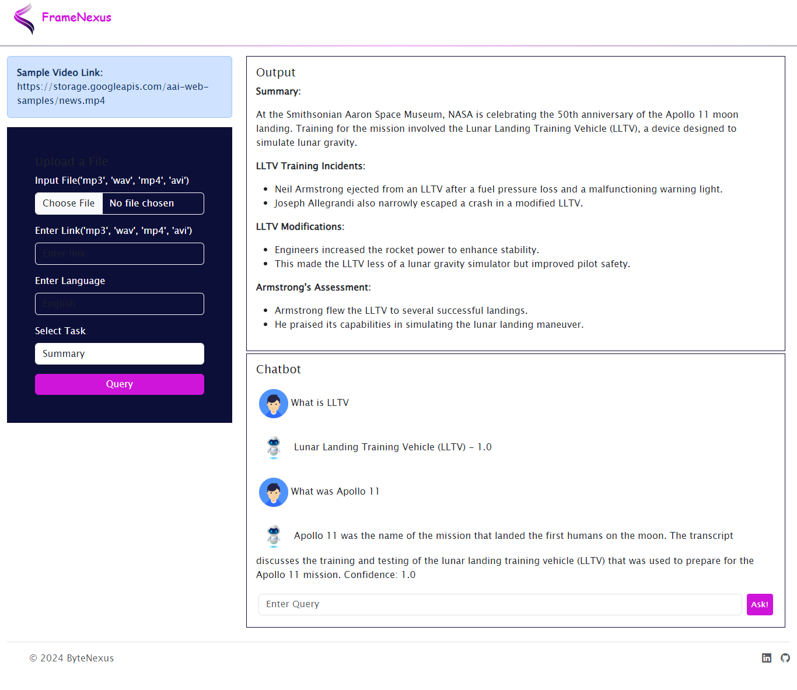

## Frame Nexus

**Frame Nexus** simplifies video comprehension with its suite of AI-powered features. 

**Requirements:**

* Gemini Secret Key ([Get Google API](https://developers.google.com/focus/ai-development))
* Assembly API Key ([Get AssemblyAI API](https://www.assemblyai.com/docs/))
* Google Application Credentials JSON File ([Generate Json File With Key](https://developers.google.com/workspace/guides/create-credentials))

**Installation:**

```bash
pip install -r requirements.txt
```
**Home Screen**



**Project Introduction**

Frame Nexus empowers you to unlock the content within your videos. Generate summaries, translations, transcripts, meeting minutes, and even query the content directly. 

**Problem & Solution:**

Frame Nexus tackles common video consumption challenges  such as:

* Time constraints for busy viewers
* Language barriers
* Difficulty capturing meeting details
* Need for multilingual transcripts

**Features:**

* **Summarization:** Get concise summaries of video content.
* **Meeting Minutes Creation:** Automatically capture key points and decisions from meetings.
* **Translation in Any Language:** Break down communication barriers with seamless translation.
* **Transcript Creation:** Generate accurate transcripts of your videos.
* **AI-Powered Chatbot:** Interact with the video content through an AI-powered chatbot for specific queries.

**Our Toolkit:**

* **Frontend & UI/UX:**
    * Figma & Canva
    * HTML, CSS & JS
    * Bootstrap 5
* **Libraries:**
    * Flask
    * Markdown2
* **LLMs & AI Tools:**
    * Google Generative AI
    * AssemblyAI
    * Gemini PRO

**Our Team:**

* Muhammad Hamza [Linkedin](https://www.linkedin.com/pub/dir/Muhammad/Hamza)
* Tabinda Noor [Linkedin](https://pk.linkedin.com/in/tabinda-noor-935429237)
* Jahanzeb Khan [Linkedin](https://www.linkedin.com/pub/dir/Jahanzeb/Khan)
* Umama Nasir Abbas
* Muhammad Hammad

**Contribution:**

We welcome your creativity! Feel free to contribute to this repository and extend its capabilities.
